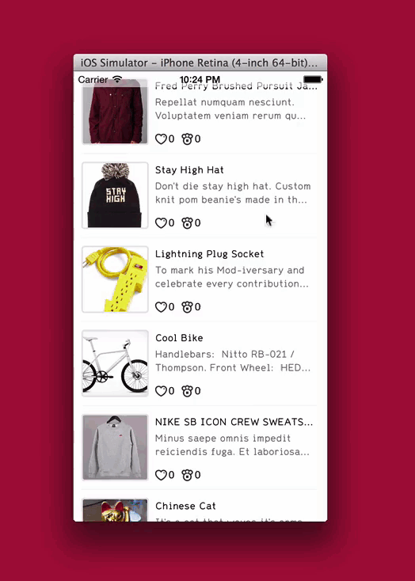

MNKDraggableDroppable provides a rich and customisable drag and drop API for iOS apps.

**Note** - MNKDraggableDroppable is still in early stages of development - coming soon.

A draggable view can be moved with user interaction. A droppable view provides an area in which a draggable view can be dropped. MNKDraggableDroppable allows you to identify a view as a draggable or droppable, and provides a mechanism for responding to events involving the two.

Features:
- Identify a view as draggable or droppable in a single line of code.
- Add draggable behaviour to a view without having to go through the routine `UIPanGestureRecognizer` rigmarole.
- Respond to events involving draggable and droppable views (example: a draggable was dropped on a droppable).
- Apply visual states to draggable and droppable views during the different phases of a drag and drop gesture.
- Animate a draggable view back to it's starting location, or a defined drop location with UIKitDynamics snap behaviours.
- Manage separate collections of draggable and droppable views.




## Installation

*I'm still writing this component so a CocoaPod hasn't yet been released due to the code being subject to change.*

## Usage

### Overview

The API consists of the following components:

- `MNKDraggableDroppable` - Instances of `MNKDraggableDroppable` are responsible for managing a collection of draggable views, a collection of droppable views, and notifying other components of your application about any events that happen involving the two.

- `<MNKDraggableDroppableDelegate>` - The `delegate` of a `MNKDraggableDroppable` object should adopt the `MNKDraggableDroppableDelegate` protocol to be notified of any drag and drop events involving any views identified as draggable or droppable.

- `<MNKDraggableView>` - The `MNKDraggableView` protocol is adopted by `UIView` subclasses to be registered as draggable. It's methods allow behaviour and appearance customisation during user drag and drop interaction.

- `<MNKDroppableView>` - The `MNKDroppableView` protocol is adopted by `UIView` subclasses to be registered as droppable. It's methods allow behaviour and appearance customisation during user drag and drop interaction.

### Basic Use

A basic usage is given below:

```
#import "MNKDraggableDroppable.h"
#import "ViewController.h"

@interface ViewController () <MNKDraggableDroppableDelegate>
@property (strong, nonatomic) MNKDraggableDroppable *dragDropController;
@end

@implementation ViewController

#pragma mark View Lifecycle

- (void)viewDidLoad
{
    [super viewDidLoad];

    // Note: the next 6 lines of code would typically be achieved in Interface Builder with defined outlets. Code given here for demonstrative purpose.
    self.dragDropController = [MNKDraggableDroppable controllerWithReferenceView:self.view];
    self.dragDropController.delegate = self;
    UIView *draggable = [[UIView alloc] initWithFrame:CGRectMake(50, 50, 50, 50)];
    UIView *droppable = [[UIView alloc] initWithFrame:CGRectMake(0, 100, 200, 200)];
    [self.view addSubView:draggable];
    [self.view addSubView:droppable];

    [self.dragDropController registerDraggableView:draggable];
    [self.dragDropController registerDroppableView:droppable];
}

- (void)draggableDroppable:(MNKDraggableDroppable *)draggableDroppable draggable:(UIView *)draggable didDropIntoDroppable:(UIView *)droppable gesture:(UIPanGestureRecognizer *)gestureRecognizer
{
    NSLog(@"Draggable (%@) was dropped into droppable (%@)", draggable, droppable);
}

```

### Registering Draggable Views

To register a view as draggable:
```
[self.dragDropController registerDraggableView:view];
```

This adds a `UIPanGestureRecognizer` to the view that allows a user to drag the view around the screen with touch. The method returns the gesture recognizer should you wish to set your class as it's `delegate` or define additional actions.

To deregister a draggable view:
```
[self.dragDropController deregisterDraggableView:view];
```

### Registering Droppable Views

Similarly:
```
[self.dragDropController registerDroppableView:view];
[self.dragDropController deregisterDroppableView:view];
```

### Responding to Drag and Drop Events

Respond to drag and drop events by adopting the `MNKDraggableDroppableDelegate` protocol and setting the `MNKDraggableDroppable` delegate to the conforming class.

Respond to a draggable drag start:

```
- (void)draggableDroppable:(MNKDraggableDroppable *)draggableDroppable draggableGestureDidBegin:(UIPanGestureRecognizer *)gestureRecognizer draggable:(UIView *)draggable
{
    NSLog(@"Draggable drag gesture started: %@", log);
}
```

Respond to a draggable drag end (and a drop into a droppable):

```
- (void)draggableDroppable:(MNKDraggableDroppable *)draggableDroppable draggableGestureDidEnd:(UIPanGestureRecognizer *)gestureRecognizer draggable:(UIView *)draggable droppable:(UIView *)droppable
{
    if (droppable) {
      NSLog(@"Dropped!");
    }
    else {
      NSLog(@"Missed!");  
    }
}
```

### Customising a Draggable's Appearance During User Interaction

By subclassing UIView and adopting the `MNKDraggableView` protocol it's possible to customise the appearance of a draggable throughout the phases of a drag gesture.

```
@interface DraggableView <MNKDraggableView>
@end
```

#### Drag State

Customise the draggable's appearance during a drag state:

```
- (void)draggableViewApplyAppearanceStateDragging
{
    self.backgroundColor = [UIColor orangeColor];
}
```

#### Hover State

Customise the draggable's appearance during a drag state while the center is hovering over a droppable bounds:

```
- (void)draggableViewApplyAppearanceStateHovering
{
    self.backgroundColor = [UIColor redColor];
}
```

#### Resetting State

Resetting the draggable's appearance back to a regular state on gesture completion:

```
- (void)draggableViewApplyAppearanceStateRegular
{
    self.backgroundColor = [UIColor yellowColor];
}
```

### Customising a Droppable's Appearance During User Interaction

Similarly, a droppable's appearance can be customised throughout the phases of a gesture by adopting the `MNKDroppableView` protocol.

```
@interface DroppableView <MNKDroppableView>
@end
```

#### Pending State

Customise the droppable's appearance when a draggable is in motion but not over the droppable bounds:

```
- (void)droppableViewApplyAppearanceStatePending
{
    self.backgroundColor = [self blueColor];
}
```

#### Pending Drop State

Customise the droppable's appearance when a draggable's center is hovering above it's bounds:

```
- (void)droppableViewApplyAppearanceStatePendingDrop
{
    self.backgroundColor = [self purpleColor];
}
```

#### Resetting State

Resetting the droppable's appearance back to a regular state on gesture completion:

```
- (void)droppableViewApplyAppearanceStateRegular
{
    self.backgroundColor = [self cyanColor];
}
```

### Animating Draggables on Interaction Completion

The [UISnapBehaviour](https://developer.apple.com/library/ios/documentation/uikit/reference/UISnapBehavior_Class/Reference/Reference.html) class in UIKitDynamics has been used throughout MNKDraggableDroppable to animate draggables to a defined location on gesture completion (when the user lets go of the draggable).

#### Snap To Start on Miss

To snap draggables back to their starting location on miss (defaults to `NO`):

```
self.dragDropController.snapsDraggablesBackToDragStartOnMiss = YES;
```

#### Snap To Droppable Point on Hit

To snap draggables to a point inside a droppable on hit (defaults to `YES`):

```
self.dragDropController.snapsDraggablesToDroppableSnapPointOnHit = YES;
```

The snap point defaults to the droppable's center but can be set by implementing:
`droppableViewSnapPoint` defined in `<MNKDroppableView>` in your droppable view class:

```
- (CGPoint)droppableViewSnapPoint
{
    return CGPointMake(5.0f, 5.0f);
}
```

## Examples

An Xcode project is included with this repository to demonstrate the features of this component and to provide an indication of how the API is meant to be used.

## Roadmap

The library is still in early stages of development. New functionality will be added as requirements are encountered.

## Contributing

Contribution welcome. Please keep the README up to date.

## Contact

[@adamwaite](https://twitter.com/AdamWaite)

## License

Copyright (c) 2014 Adam Waite. All rights reserved.

Permission is hereby granted, free of charge, to any person obtaining a copy
of this software and associated documentation files (the "Software"), to deal
in the Software without restriction, including without limitation the rights
to use, copy, modify, merge, publish, distribute, sublicense, and/or sell
copies of the Software, and to permit persons to whom the Software is
furnished to do so, subject to the following conditions:

The above copyright notice and this permission notice shall be included in
all copies or substantial portions of the Software.

THE SOFTWARE IS PROVIDED "AS IS", WITHOUT WARRANTY OF ANY KIND, EXPRESS OR
IMPLIED, INCLUDING BUT NOT LIMITED TO THE WARRANTIES OF MERCHANTABILITY,
FITNESS FOR A PARTICULAR PURPOSE AND NONINFRINGEMENT. IN NO EVENT SHALL THE
AUTHORS OR COPYRIGHT HOLDERS BE LIABLE FOR ANY CLAIM, DAMAGES OR OTHER
LIABILITY, WHETHER IN AN ACTION OF CONTRACT, TORT OR OTHERWISE, ARISING FROM,
OUT OF OR IN CONNECTION WITH THE SOFTWARE OR THE USE OR OTHER DEALINGS IN
THE SOFTWARE.
